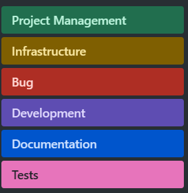

# Metodologia

## Gerenciamento de Projeto
O SCRUM foi escolhido como _framework_ para o desenvolvimento deste projeto. De acordo com Schwaber e Sutherland (2020):
"Scrum emprega uma abordagem iterativa e incremental para otimizar a previsibilidade e controlar o risco. Scrum envolve grupos de pessoas que, coletivamente, possuem todas as habilidades e conhecimentos necessários para fazer o trabalho e compartilhar ou adquirir essas habilidades conforme necessário."

Desta forma foi necessário dividir e equipe em papeis, formando assim nosso _Scrum Team_.

### Divisão de Papéis

A equipe utiliza o Scrum como base para definição do processo de desenvolvimento.
- Scrum Master: David Milan
- Product Owner: Breno Figueiredo
- Equipe de Desenvolvimento: Adrian Sodré, Antonio Cesar de Araujo, Breno Figueiredo, Cláudio Souza, David Milan e Patrícia Rodrigues
- Equipe de Design: Patrícia Rodrigues

### Processo

Para organização e distribuição das tarefas do projeto, a equipe está utilizando o GitHub, estruturado com as seguintes listas:

- Backlog: recebe as tarefas a serem trabalhadas e representa o Product Backlog. Todas as atividades identificadas no decorrer do projeto também devem ser incorporadas a esta lista. 
- To Do: Esta lista representa o Sprint Backlog. Este é o Sprint atual que estamos trabalhando. 
- In Progress: Quando uma tarefa tiver sido iniciada, ela é movida para cá.
- Test: Nesta fase, as tarefas são submetidas a testes para verificar se atendem aos requisitos e estão funcionando conforme o esperado.
- Done: Nesta lista são colocadas as tarefas que passaram pelos testes e controle de qualidade e estão prontos para ser entregues ao usuário.

Para acessar Kanban do grupo no GitHub, [Clique aqui](https://github.com/orgs/ICEI-PUC-Minas-PMV-ADS/projects/1066/views/1). Por favor, verifique se você possui as permissões necessárias para acessar o quadro.

Abaixo, está um exemplo de como está ficando o quadro.

### Etiquetas

As tarefas são, ainda, etiquetadas em função da natureza da atividade e seguem o seguinte esquema de cores/categorias:

<ul>
  <li>Bug (Erro no código)</li>
  <li>Desenvolvimento (Development)</li>
  <li>Documentação (Documentation)</li>
  <li>Gerência de Projetos (Project Management)</li>
  <li>Infraestrutura (Infrastructure)</li>
  <li>Testes (Tests)</li>
</ul>

<figure> 
  Figura 3 - Tela do esquema de cores e categorias</figcaption>
</figure> 
  
### Ferramentas

Utilizamos diversas plataformas para o desenvolvimento deste projeto. A descrição das plataformas e seus respectivos propósitos está apresentada na tabela abaixo.

| AMBIENTE                            | PLATAFORMA                         | LINK DE ACESSO                         |
|-------------------------------------|------------------------------------|----------------------------------------|
| Repositório de código fonte         | GitHub                             | https://github.com/ICEI-PUC-Minas-PMV-ADS/pmv-ads-2024-1-e1-proj-web-t8-pmv-ads-2024-1-e1-projfacilistas/blob/main/codigo-fonte/README.md |
| Documentos do projeto               | GitHub                             | https://github.com/ICEI-PUC-Minas-PMV-ADS/pmv-ads-2024-1-e1-proj-web-t8-pmv-ads-2024-1-e1-projfacilistas/tree/main/documentos |
| Projeto de Interface                | Figma                              | https://www.figma.com/proto/ZkIOb8kayKYGIQjyN8q8QC/Prototipo-FaciListas-2?node-id=451-185&t=SZIAie3RbWFMgIyE-1&scaling=contain&content-scaling=fixed&page-id=0%3A1&starting-point-node-id=451%3A80 |
| Gerenciamento do Projeto            | GitHub                             | https://github.com/orgs/ICEI-PUC-Minas-PMV-ADS/projects/1066/views/1 |
| Hospedagem do site                  | GitHub                             | [https://github.com/orgs/ICEI-PUC-Minas-PMV-ADS/projects/1066/views/1](https://icei-puc-minas-pmv-ads.github.io/pmv-ads-2024-1-e1-proj-web-t8-pmv-ads-2024-1-e1-projfacilistas/codigo-fonte/paginaIncial/) |

### Estratégia de Organização de Codificação 

Todos os artefatos relacionados a implementação e visualização dos conteúdos do projeto do site estão inseridos na pasta [codigo-fonte](https://github.com/ICEI-PUC-Minas-PMV-ADS/pmv-ads-2024-1-e1-proj-web-t8-pmv-ads-2024-1-e1-projfacilistas/tree/main/codigo-fonte).
