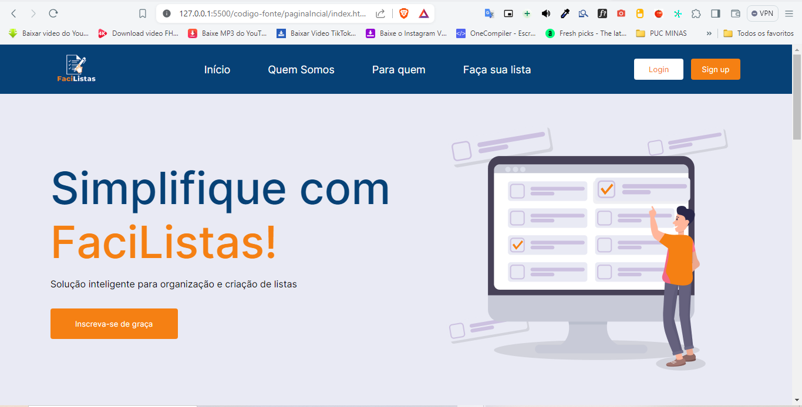

# Programação de Funcionalidades

Pré-requisitos: [Especificação do Projeto](https://github.com/ICEI-PUC-Minas-PMV-ADS/pmv-ads-2024-1-e1-proj-web-t8-pmv-ads-2024-1-e1-projfacilistas/blob/main/documentos/02-Especifica%C3%A7%C3%A3o%20do%20Projeto.md), [Metodologia](https://github.com/ICEI-PUC-Minas-PMV-ADS/pmv-ads-2024-1-e1-proj-web-t8-pmv-ads-2024-1-e1-projfacilistas/blob/main/documentos/03-Metodologia.md), [Projeto de Interface](https://github.com/ICEI-PUC-Minas-PMV-ADS/pmv-ads-2024-1-e1-proj-web-t8-pmv-ads-2024-1-e1-projfacilistas/blob/main/documentos/04-Projeto%20de%20Interface.md).

### Título da Cadastro (RF-02)

Responsável : David Milan

O acesso a tela de cadastro poderá ser feito através da opção de menu “Sign Up”. As estruturas de dados foram baseadas em HTML, CSS e JS.

#### Requisito atendido

[RF-x: adicione a descrição do requisito atendido]

#### Artefatos da funcionalidade

[Adicione os nomes dos arquivos relacionados ao desenvolvimento da funcionalidade]

#### Estrutura de Dados

[Caso exista estrutura de dados, adicione aqui]

#### Instruções de acesso

[Adicione as orientações de acesso à funcionalidade]

#### Responsável

[Adicione nome do responsável pelo desenvolvimento da funcionalidade]

### Título da Login (RF -03)

Responsável : Patrícia Ester Ferreira Rodrigues

O acesso a tela de cadastro poderá ser feito através da opção de menu “Login”. As estruturas de dados foram baseadas em HTML, CSS e JS.

#### Requisito atendido

RF-03: Os usuários registrados devem poder fazer login no site utilizando suas credenciais de conta (e-mail e senha).

#### Artefatos da funcionalidade

- login.html
- style-login.html
- scrtipt-login.html
- login.html

#### Estrutura de Dados

- [login.html](https://github.com/ICEI-PUC-Minas-PMV-ADS/pmv-ads-2024-1-e1-proj-web-t8-pmv-ads-2024-1-e1-projfacilistas/tree/main/codigo-fonte/login)

#### Instruções de acesso

1- Abra um navegador de Internet e informe a seguinte URL: https://icei-puc-minas-pmv-ads.github.io/pmv-ads-2024-1-e1-proj-web-t8-pmv-ads-2024-1-e1-projfacilistas/

  2- Ao clicar em “Login” no canto superior direito da tela, terá acesso a página de login.

#### Responsável

[Adicione nome do responsável pelo desenvolvimento da funcionalidade]

> **Links Úteis**:
> - [Trabalhando com HTML5 Local Storage e JSON](https://www.devmedia.com.br/trabalhando-com-html5-local-storage-e-json/29045)
> - [JSON Tutorial](https://www.w3resource.com/JSON)
> - [JSON - Introduction (W3Schools)](https://www.w3schools.com/js/js_json_intro.asp)
> - [JSON Tutorial (TutorialsPoint)](https://www.tutorialspoint.com/json/index.htm)

