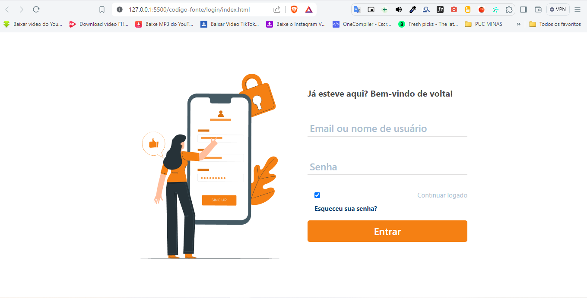

# Programação de Funcionalidades

Pré-requisitos: [Especificação do Projeto](https://github.com/ICEI-PUC-Minas-PMV-ADS/pmv-ads-2024-1-e1-proj-web-t8-pmv-ads-2024-1-e1-projfacilistas/blob/main/documentos/02-Especifica%C3%A7%C3%A3o%20do%20Projeto.md), [Metodologia](https://github.com/ICEI-PUC-Minas-PMV-ADS/pmv-ads-2024-1-e1-proj-web-t8-pmv-ads-2024-1-e1-projfacilistas/blob/main/documentos/03-Metodologia.md), [Projeto de Interface](https://github.com/ICEI-PUC-Minas-PMV-ADS/pmv-ads-2024-1-e1-proj-web-t8-pmv-ads-2024-1-e1-projfacilistas/blob/main/documentos/04-Projeto%20de%20Interface.md).

### Ordenação de listas (RF-01)

### Tela de Cadastro (RF-02)

A tela de cadastro poderá ser acessada através da opção “Sign Up” no cabeçalho. As estruturas de dados foram baseadas em HTML, CSS e JS.

#### Requisito atendido

RF-02: permitir que usuários cadastrem uma nova conta.

#### Artefatos da funcionalidade
Os artefatos desta funcionalidade estão localizados na pasta de [cadastro](https://github.com/ICEI-PUC-Minas-PMV-ADS/pmv-ads-2024-1-e1-proj-web-t8-pmv-ads-2024-1-e1-projfacilistas/tree/main/codigo-fonte/cadastro).

- index.html
- script.js
- syle.css

#### Estrutura de Dados

- [index.html](https://github.com/ICEI-PUC-Minas-PMV-ADS/pmv-ads-2024-1-e1-proj-web-t8-pmv-ads-2024-1-e1-projfacilistas/blob/main/codigo-fonte/cadastro/index.html)

#### Instruções de acesso

Para acessar a página de cadastro diretamente informe o seguinte URL para o navegador: https://icei-puc-minas-pmv-ads.github.io/pmv-ads-2024-1-e1-proj-web-t8-pmv-ads-2024-1-e1-projfacilistas/codigo-fonte/cadastro/index.html

#### Responsável

David Milan

### Título da Login (RF-03)

O acesso a tela de cadastro poderá ser feito através da opção de menu “Login”. As estruturas de dados foram baseadas em HTML, CSS e JS.

#### Requisito atendido

RF-03: Os usuários registrados devem poder fazer login no site utilizando suas credenciais de conta (e-mail e senha).

#### Artefatos da funcionalidade

- index.html
- style-login.css
- scrtipt-login.js
- login.html

#### Estrutura de Dados

- [login.html](https://github.com/ICEI-PUC-Minas-PMV-ADS/pmv-ads-2024-1-e1-proj-web-t8-pmv-ads-2024-1-e1-projfacilistas/tree/main/codigo-fonte/login)

#### Instruções de acesso

1- Abra um navegador de Internet e informe a seguinte URL: https://icei-puc-minas-pmv-ads.github.io/pmv-ads-2024-1-e1-proj-web-t8-pmv-ads-2024-1-e1-projfacilistas/codigo-fonte/paginaIncial

  2- Ao clicar em “Login” no canto superior direito da tela, terá acesso a página de login.

  3- Você também pode acessar a página de login diretamente na seguinte URL: https://icei-puc-minas-pmv-ads.github.io/pmv-ads-2024-1-e1-proj-web-t8-pmv-ads-2024-1-e1-projfacilistas/codigo-fonte/login/login.html

#### Responsável

Responsável : Patrícia Ester Ferreira Rodrigues

### Tela das listas (RF-04, RF-05, RF-06, RF-07, RF-08 e RF-10)

O acesso a tela das listas poderá ser feito através da opção de menu “Faça suas listas”. As estruturas de dados foram baseadas em HTML, CSS e JS.

#### Requisitos atendidos

RF-04: O site deve mostrar cartões na página inicial, cada um representando uma lista diferente que os usuários podem acessar.

RF-05: Os usuários devem ser capazes de adicionar itens à lista escolhida.

RF-06: Os usuários devem poder remover itens previamente adicionados à lista, caso desejem modificar sua seleção.

RF-07 Os usuários devem poder marcar um item como concluído à lista.

RF-08: Os usuários devem poder deletar uma lista.

RF-10: Os usuários devem poder aumentar e diminuir a quantidade do item à lista.

#### Artefatos da funcionalidade

- index.html
- footer.css
- header.css
- style.css
- createYourLists.js
- header.js
- yourLists.js

#### Estrutura de Dados

- [index.html](https://github.com/ICEI-PUC-Minas-PMV-ADS/pmv-ads-2024-1-e1-proj-web-t8-pmv-ads-2024-1-e1-projfacilistas/tree/main/codigo-fonte/sistema)

#### Instruções de acesso

1- Abra um navegador de Internet e informe a seguinte URL: https://icei-puc-minas-pmv-ads.github.io/pmv-ads-2024-1-e1-proj-web-t8-pmv-ads-2024-1-e1-projfacilistas/codigo-fonte/paginaIncial

  2- Ao clicar em “Faça sua lista” no canto superior direito da tela, terá acesso a página de listas.

  3- Você também pode acessar a página de login diretamente na seguinte URL: https://icei-puc-minas-pmv-ads.github.io/pmv-ads-2024-1-e1-proj-web-t8-pmv-ads-2024-1-e1-projfacilistas/codigo-fonte/sistema/index.html

#### Responsável

Responsável : Breno Santos Figueiredo

### Tela das listas (RF-09)

O acesso a tela das listas poderá ser feito através da opção de menu “Faça suas listas”. As estruturas de dados foram baseadas em HTML, CSS e JS.

#### Requisito atendido

RF-09: Os usuários devem poder criar uma lista do zero ou através de um template.

#### Artefatos da funcionalidade

- index.html
- footer.css
- header.css
- style.css
- createYourLists.js
- header.js
- yourLists.js

#### Estrutura de Dados

- [index.html](https://github.com/ICEI-PUC-Minas-PMV-ADS/pmv-ads-2024-1-e1-proj-web-t8-pmv-ads-2024-1-e1-projfacilistas/tree/main/codigo-fonte/sistema)

#### Instruções de acesso

1- Abra um navegador de Internet e informe a seguinte URL: https://icei-puc-minas-pmv-ads.github.io/pmv-ads-2024-1-e1-proj-web-t8-pmv-ads-2024-1-e1-projfacilistas/codigo-fonte/paginaIncial

  2- Ao clicar em “Faça sua lista” no canto superior direito da tela, terá acesso a página de listas.

  3- Você também pode acessar a página de login diretamente na seguinte URL: https://icei-puc-minas-pmv-ads.github.io/pmv-ads-2024-1-e1-proj-web-t8-pmv-ads-2024-1-e1-projfacilistas/codigo-fonte/sistema/index.html

#### Responsável

Responsável : Breno Santos Figueiredo

### Tela das listas (RF-11)

O acesso a tela das listas poderá ser feito através da opção de menu “Faça suas listas”. As estruturas de dados foram baseadas em HTML, CSS e JS.

#### Requisito atendido

RF-11: Os usuários devem poder marcar as listas como favoritas.

#### Artefatos da funcionalidade

- index.html
- footer.css
- header.css
- style.css
- createYourLists.js
- header.js
- yourLists.js

#### Estrutura de Dados

- [index.html](https://github.com/ICEI-PUC-Minas-PMV-ADS/pmv-ads-2024-1-e1-proj-web-t8-pmv-ads-2024-1-e1-projfacilistas/tree/main/codigo-fonte/sistema)

#### Instruções de acesso

1- Abra um navegador de Internet e informe a seguinte URL: https://icei-puc-minas-pmv-ads.github.io/pmv-ads-2024-1-e1-proj-web-t8-pmv-ads-2024-1-e1-projfacilistas/codigo-fonte/paginaIncial

  2- Ao clicar em “Faça sua lista” no canto superior direito da tela, terá acesso a página de listas.

  3- Você também pode acessar a página de login diretamente na seguinte URL: https://icei-puc-minas-pmv-ads.github.io/pmv-ads-2024-1-e1-proj-web-t8-pmv-ads-2024-1-e1-projfacilistas/codigo-fonte/sistema/index.html

#### Responsável

Responsável : David Milan
